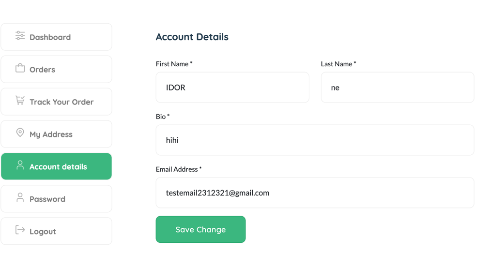
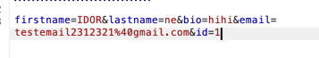

## IDOR

We will test feature Update Account Details

`http://localhost:3000/page-account`

We detect id in body 

id=2,3,4,5???

We submit, and change account to another account => Check IDOR

account with id = `3`

