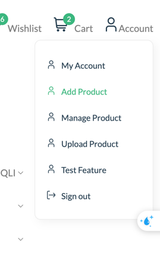
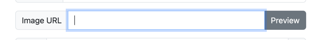
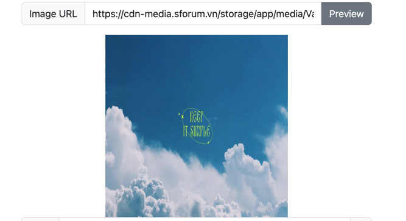
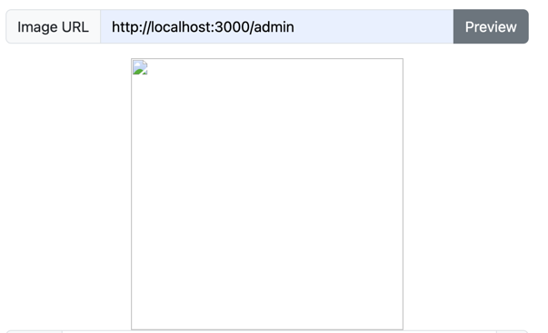
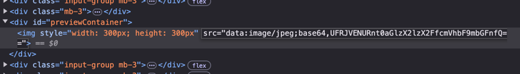
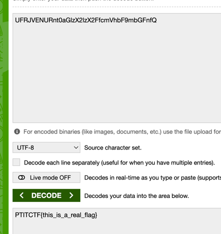

## SSRF

### Preparation 

Go to settings and set `SSRF` is `Yes`

I will check SSRF vul in Add Product `http://localhost:3000/product/add`

We will test feature Preview Image

Server get URL image, send request to show image for us

What if we inject: `http://localhost:3000/admin`

We get source here 

Use base64 decode

