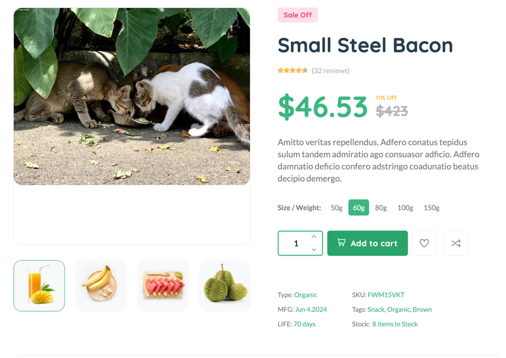
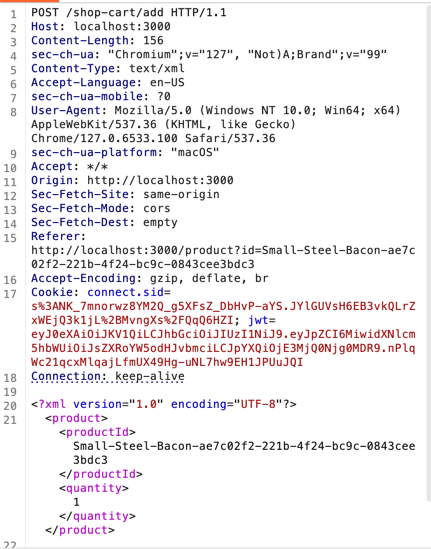
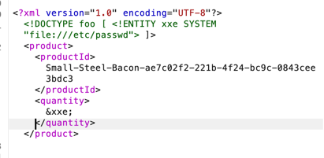

## XXE

We check feature `Add To Cart` 
Example in: `http://localhost:3000/product?id=Small-Steel-Bacon-ae7c02f2-221b-4f24-bc9c-0843cee3bdc3`

Open in Burp Suite, we detect xml in body

We inject 

and send!!!